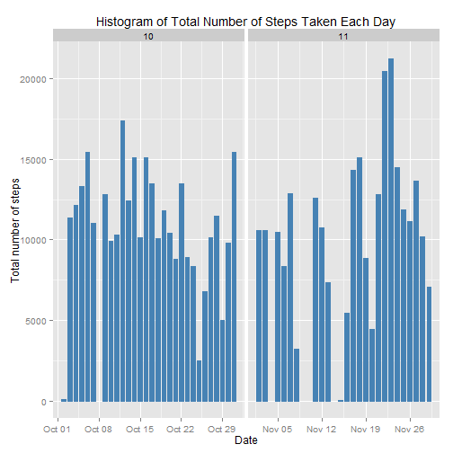
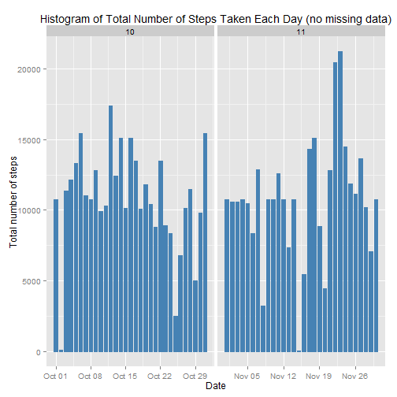

## Loading and preprocessing the data

```r
#setwd("your working directory")
unzip("activity.zip")
data_set <- read.csv("activity.csv", colClasses = c("integer", "Date", "factor"))
data_set $month <- as.numeric(format(data_set$date, "%m"))
num_miss <- na.omit(data_set)
rownames(num_miss) <- 1:nrow(num_miss)
head(num_miss)
```

```
##   steps       date interval month
## 1     0 2012-10-02        0    10
## 2     0 2012-10-02        5    10
## 3     0 2012-10-02       10    10
## 4     0 2012-10-02       15    10
## 5     0 2012-10-02       20    10
## 6     0 2012-10-02       25    10
```

```r
dim(num_miss)
```

```
## [1] 15264     4
```

```r
library(ggplot2)
```


## What is mean total number of steps taken per day?
For this part of the assignment, you can ignore the missing values in the dataset.

* Make a histogram of the total number of steps taken each day

```r
ggplot(num_miss, aes(date, steps)) + geom_bar(stat = "identity", colour = "steelblue", fill = "steelblue", width = 0.7) + facet_grid(. ~ month, scales = "free") + labs(title = "Histogram of Total Number of Steps Taken Each Day", x = "Date", y = "Total number of steps")
```

 

* Calculate and report the mean and median total number of steps taken per day

Mean total number of steps taken per day:

```r
total_no_steps <- aggregate(num_miss$steps, list(Date = num_miss$date), FUN = "sum")$x
mean(total_no_steps)
```

```
## [1] 10766
```
Median total number of steps taken per day:

```r
median(total_no_steps)
```

```
## [1] 10765
```


## What is the average daily activity pattern?
* Make a time series plot (i.e. type = "l") of the 5-minute interval (x-axis) and the average number of steps taken, averaged across all days (y-axis)


```r
avg_no_steps <- aggregate(num_miss$steps, list(interval = as.numeric(as.character(num_miss$interval))), FUN = "mean")
names(avg_no_steps)[2] <- "meanOfSteps"

ggplot(avg_no_steps, aes(interval, meanOfSteps)) + geom_line(color = "steelblue", size = 0.8) + labs(title = "Time Series Plot of the 5-minute Interval", x = "5-minute intervals", y = "Average Number of Steps Taken")
```

 

* Which 5-minute interval, on average across all the days in the dataset, contains the maximum number of steps?

```r
avg_no_steps[avg_no_steps$meanOfSteps == max(avg_no_steps$meanOfSteps), ]
```

```
##     interval meanOfSteps
## 104      835       206.2
```

## Imputing missing values

* The total number of rows with NAs:


```r
sum(is.na(data_set))
```

```
## [1] 2304
```

* Devise a strategy for filling in all of the missing values in the dataset. The strategy does not need to be sophisticated. For example, you could use the mean/median for that day, or the mean for that 5-minute interval, etc.

My strategy is to use the mean for that 5-minute interval to fill each NA value in the steps column.

* Create a new dataset that is equal to the original dataset but with the missing data filled in.


```r
new_data_set <- data_set 
for (i in 1:nrow(new_data_set)) {
    if (is.na(new_data_set$steps[i])) {
        new_data_set$steps[i] <- avg_no_steps[which(new_data_set$interval[i] == avg_no_steps$interval), ]$meanOfSteps
    }
}

head(new_data_set)
```

```
##     steps       date interval month
## 1 1.71698 2012-10-01        0    10
## 2 0.33962 2012-10-01        5    10
## 3 0.13208 2012-10-01       10    10
## 4 0.15094 2012-10-01       15    10
## 5 0.07547 2012-10-01       20    10
## 6 2.09434 2012-10-01       25    10
```

```r
sum(is.na(new_data_set))
```

```
## [1] 0
```

* Make a histogram of the total number of steps taken each day and Calculate and report the mean and median total number of steps taken per day. 


```r
ggplot(new_data_set, aes(date, steps)) + geom_bar(stat = "identity",
                                             colour = "steelblue",
                                             fill = "steelblue",
                                             width = 0.7) + facet_grid(. ~ month, scales = "free") + labs(title = "Histogram of Total Number of Steps Taken Each Day (no missing data)", x = "Date", y = "Total number of steps")
```

 

* Do these values differ from the estimates from the first part of the assignment? What is the impact of imputing missing data on the estimates of the total daily number of steps?

Mean total number of steps taken per day:

```r
new_total_no_steps <- aggregate(new_data_set$steps, 
                           list(Date = new_data_set$date), 
                           FUN = "sum")$x
new_mean <- mean(new_total_no_steps)
new_mean
```

```
## [1] 10766
```
Median total number of steps taken per day:

```r
new_median <- median(new_total_no_steps)
new_median
```

```
## [1] 10766
```
Compare them with the two before imputing missing data:

```r
old_mean <- mean(total_no_steps)
old_median <- median(total_no_steps)
new_mean - old_mean
```

```
## [1] 0
```

```r
new_median - old_median
```

```
## [1] 1.189
```
So, after imputing the missing data with the mean values, the new mean of total steps taken per day is the same as that of the old mean; the new median of total steps taken per day is greater than that of the old median. Due to time constraints, I used the mean and median as imputing function; others such as MICE package and bootstraping methods can be considered in the future.


## Are there differences in activity patterns between weekdays and weekends?

* Create a new factor variable in the dataset with two levels -- "weekday" and "weekend" indicating whether a given date is a weekday or weekend day.


```r
head(new_data_set)
```

```
##     steps       date interval month
## 1 1.71698 2012-10-01        0    10
## 2 0.33962 2012-10-01        5    10
## 3 0.13208 2012-10-01       10    10
## 4 0.15094 2012-10-01       15    10
## 5 0.07547 2012-10-01       20    10
## 6 2.09434 2012-10-01       25    10
```

```r
new_data_set$weekdays <- factor(format(new_data_set$date, "%A"))
levels(new_data_set$weekdays)
```

```
## [1] "Friday"    "Monday"    "Saturday"  "Sunday"    "Thursday"  "Tuesday"  
## [7] "Wednesday"
```

```r
levels(new_data_set$weekdays) <- list(weekday = c("Monday", "Tuesday",
                                             "Wednesday", 
                                             "Thursday", "Friday"),
                                 weekend = c("Saturday", "Sunday"))
levels(new_data_set$weekdays)
```

```
## [1] "weekday" "weekend"
```

```r
table(new_data_set$weekdays)
```

```
## 
## weekday weekend 
##   12960    4608
```

* Make a panel plot containing a time series plot (i.e. type = "l") of the 5-minute interval (x-axis) and the average number of steps taken, averaged across all weekday days or weekend days (y-axis).


```r
avg_no_steps <- aggregate(new_data_set$steps, 
                      list(interval = as.numeric(as.character(new_data_set$interval)), 
                           weekdays = new_data_set$weekdays),
                      FUN = "mean")
names(avg_no_steps)[3] <- "meanOfSteps"
library(lattice)
xyplot(avg_no_steps$meanOfSteps ~ avg_no_steps$interval | avg_no_steps$weekdays, 
       layout = c(1, 2), type = "l", 
       xlab = "Interval", ylab = "Number of steps")
```

 
